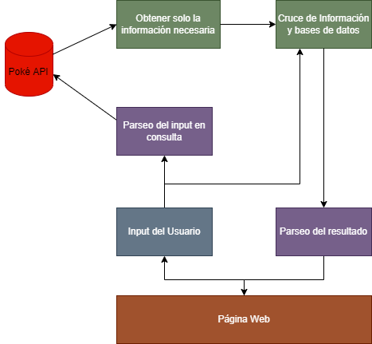
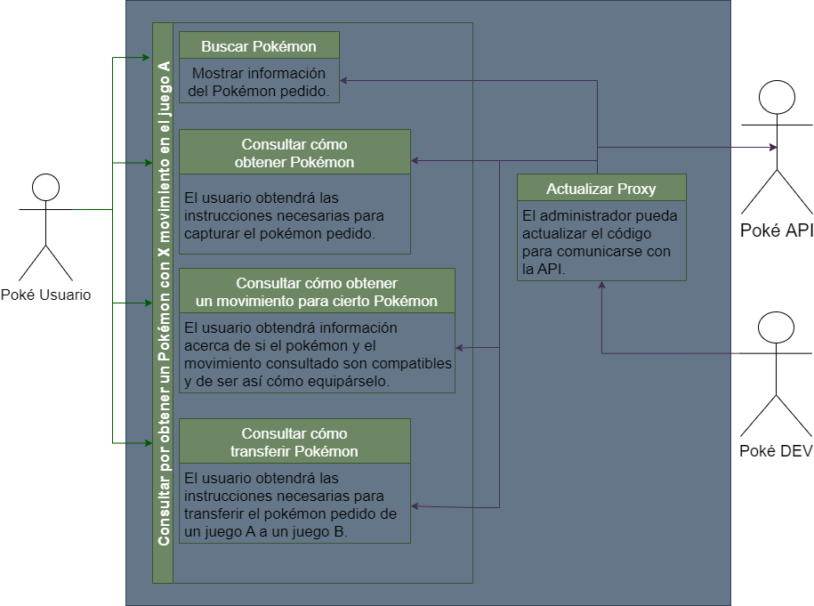

# **Definición Proyecto**

## **Grupo 13**

Integrantes:
- Sebastián Carrasco O.
- Miguel Monzó D.
- Álvaro Morales T.
- Camilo Urzúa G.
- Franz Widerstrom M.

## 1.Identificación del problema

Existen diversas fuentes de información de Pokémon que engloban la totalidad de requerimientos de los jugadores de la saga Pokémon. Ejemplo: Existen un pokémon llamado *Shedinja* y me gustaría tenerlo en mi equipo de 8va generación con el movimiento *Mimético*, ¿Cómo lo logro? Para ello, es necesario tener una copia de cualquier juego de Pokémon de la región de *Hoenn* (Esmeralda, Rubí y Safiro), ir a la ruta X y capturar un *Nincada*. Evolucionar este pokémon a *Ninjask* con un hueco en el equipo, para que luego este hueco lo ocupe un *Shedinja*. Intercambiar este pokémon a el juego Pokémon Rojo Fuego e ir al tutor de movimientos de la ruta Y. Finalmente, solo falta transerirlo entre las generaciones 4ta, 5ta, 6ta y para llevarlo a la plataforma de *Pokémon Home* y desde ahí transferirlo a un juego de Pokémo Espada o Escudo.

 
\pagebreak 

## 2.Descripción de nuestro solución al problema

Existe una API llamada [*Poké API*](https://pokeapi.co), que tiene la información. A partir de ello, nosotros podemos realizar cruce de información entre diversas bases de datos, junto conocimiento previo por parte del equipo. De esta manera, podemos obtener los pasos necesarios para que el usuario cumpla su objetivo.

    

 
\pagebreak 

## 3.Diagrama de los casos de uso

    

